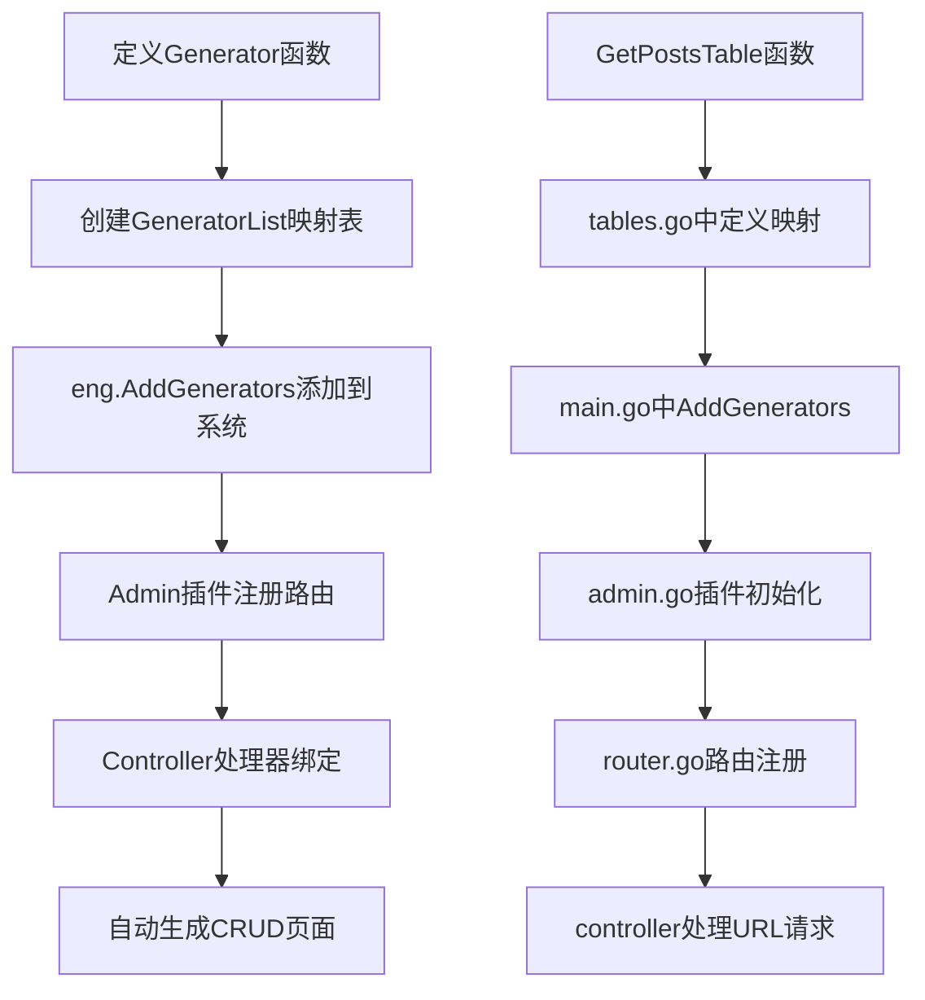
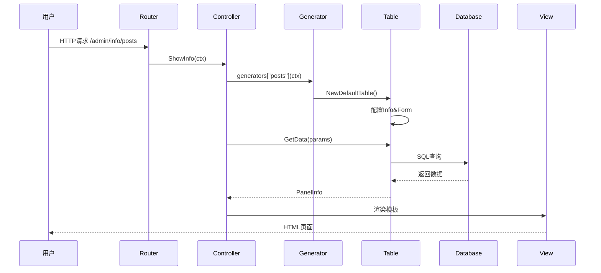

# GoAdmin CRUD生成机制详解

## 📋 概述

GoAdmin通过`eng.AddGenerators()`方法实现了**自动化CRUD生成**，只需定义数据模型Generator函数，系统就能自动生成完整的**增删改查页面**和**数据操作接口**。

## 🔧 核心机制流程

### 1. Generator定义与注册流程



### 2. 系统核心文件架构

| 层级 | 核心文件 | 作用 |
|------|---------|------|
| **入口层** | `main.go` | 调用`eng.AddGenerators(datamodel.Generators)` |
| **定义层** | `datamodel/tables.go` | 定义`Generators`映射表 |
| **生成层** | `datamodel/posts.go` | 具体Generator函数实现 |
| **注册层** | `engine/engine.go` | Engine.AddGenerators()方法 |
| **插件层** | `plugins/admin/admin.go` | Admin.AddGenerators()实现 |
| **路由层** | `plugins/admin/router.go` | 注册CRUD路由 |
| **控制层** | `plugins/admin/controller/` | 处理CRUD请求 |
| **模板层** | `template/template.go` | 渲染UI页面 |

## 🏗️ 详细实现机制

### 第一步：Generator接口定义

**核心文件**: `plugins/admin/modules/table/table.go`

```go
// Generator是一个函数类型，接收Context返回Table
type Generator func(ctx *context.Context) Table

// GeneratorList是Generator的映射表
type GeneratorList map[string]Generator

// Table接口定义了CRUD操作的完整功能
type Table interface {
    GetInfo() *types.InfoPanel      // 获取列表页信息
    GetForm() *types.FormPanel      // 获取表单页信息
    GetDetail() *types.InfoPanel    // 获取详情页信息
    
    GetData(ctx, params) (PanelInfo, error)    // 获取列表数据
    UpdateData(ctx, dataList) error            // 更新数据
    InsertData(ctx, dataList) error            // 插入数据
    DeleteData(pk string) error                // 删除数据
    
    GetCanAdd() bool                           // 是否允许添加
    GetEditable() bool                         // 是否可编辑
    GetDeletable() bool                        // 是否可删除
    GetExportable() bool                       // 是否可导出
}
```

### 第二步：数据模型定义

**核心文件**: `examples/datamodel/tables.go`

```go
// Generators定义了URL前缀与Generator函数的映射关系
var Generators = map[string]table.Generator{
    "posts":   GetPostsTable,    // /admin/info/posts
    "authors": GetAuthorsTable,  // /admin/info/authors
}
```

**核心文件**: `examples/datamodel/posts.go`

```go
// GetPostsTable 返回posts表的完整配置
func GetPostsTable(ctx *context.Context) table.Table {
    // 创建默认表格配置
    postsTable := table.NewDefaultTable(ctx, table.DefaultConfig().SetExportable(true))

    // ========== 配置信息展示页面 ==========
    info := postsTable.GetInfo()
    info.AddField("ID", "id", db.Int).FieldSortable()
    info.AddField("Title", "title", db.Varchar)
    info.AddField("Content", "content", db.Varchar).FieldEditAble(editType.Textarea)
    info.SetTable("posts").SetTitle("Posts").SetDescription("Posts")

    // ========== 配置表单页面 ==========
    formList := postsTable.GetForm()
    formList.AddField("ID", "id", db.Int, form.Default).FieldDisableWhenCreate()
    formList.AddField("Title", "title", db.Varchar, form.Text)
    formList.AddField("Content", "content", db.Varchar, form.RichText)
    formList.SetTable("posts").SetTitle("Posts").SetDescription("Posts")

    return postsTable
}
```

### 第三步：系统注册机制

**核心文件**: `engine/engine.go`

```go
// AddGenerators 将Generator列表添加到引擎
func (eng *Engine) AddGenerators(list ...table.GeneratorList) *Engine {
    if plug, ok := eng.PluginList.FindByName("admin"); ok {
        plug.(*admin.Admin).AddGenerators(list...)
    }
    return eng
}
```

**核心文件**: `plugins/admin/admin.go`

```go
// AddGenerators 将Generator添加到Admin插件
func (admin *Admin) AddGenerators(gen ...table.GeneratorList) *Admin {
    admin.tableList.CombineAll(gen)  // 合并到tableList中
    return admin
}

// InitPlugin 初始化插件时注册所有路由
func (admin *Admin) InitPlugin(services service.List) {
    // ... 初始化逻辑
    admin.guardian = guard.New(admin.Services, admin.Conn, admin.tableList, admin.UI.NavButtons)
    admin.handler = controller.New(admin.config, admin.tableList, admin.Conn)
    admin.initRouter()  // 注册路由
}
```

### 第四步：路由注册机制

**核心文件**: `plugins/admin/router.go`

系统自动为每个Generator注册以下路由：

```go
// CRUD路由格式定义
formats := config.GetURLFormats()

// 核心CRUD路由
authPrefixRoute.GET(formats.Info, admin.handler.ShowInfo)           // 列表页: /admin/info/{prefix}
authPrefixRoute.GET(formats.ShowCreate, admin.handler.ShowNewForm)  // 新建页: /admin/info/{prefix}/new
authPrefixRoute.GET(formats.ShowEdit, admin.handler.ShowForm)       // 编辑页: /admin/info/{prefix}/edit
authPrefixRoute.GET(formats.Detail, admin.handler.ShowDetail)       // 详情页: /admin/info/{prefix}/detail

authPrefixRoute.POST(formats.Create, admin.handler.NewForm)         // 创建: /admin/new/{prefix}
authPrefixRoute.POST(formats.Edit, admin.handler.EditForm)          // 更新: /admin/edit/{prefix}
authPrefixRoute.POST(formats.Delete, admin.handler.Delete)          // 删除: /admin/delete/{prefix}
authPrefixRoute.POST(formats.Export, admin.handler.Export)          // 导出: /admin/export/{prefix}
```

### 第五步：请求处理流程

**核心文件**: `plugins/admin/controller/show.go`

```go
// ShowInfo 显示信息列表页面
func (h *Handler) ShowInfo(ctx *context.Context) {
    prefix := ctx.Query(constant.PrefixKey)        // 获取表前缀，如"posts"
    
    panel := h.table(prefix, ctx)                  // 根据prefix获取对应的Table
    
    // 获取请求参数（分页、排序、筛选等）
    params := parameter.GetParam(ctx.Request.URL, 
        panel.GetInfo().DefaultPageSize, 
        panel.GetInfo().SortField,
        panel.GetInfo().GetSort())
    
    // 调用Table的GetData方法获取数据
    panelInfo, err := panel.GetData(ctx, params.WithIsAll(false))
    
    // 渲染模板并返回HTML
    buf := h.showTable(ctx, prefix, params, panel)
    ctx.HTML(http.StatusOK, buf.String())
}

// table方法根据prefix获取对应的Generator并执行
func (h *Handler) table(prefix string, ctx *context.Context) table.Table {
    generator := h.generators[prefix]              // 从generators映射中获取
    return generator(ctx)                          // 执行Generator函数
}
```

### 第六步：数据操作机制

**核心文件**: `plugins/admin/modules/table/default.go`

```go
// GetData 获取列表数据的具体实现
func (tb *DefaultTable) GetData(ctx *context.Context, params parameter.Parameters) (PanelInfo, error) {
    // 构建SQL查询
    queryStmt := tb.db.Table(tb.info.Table).Select(tb.getColumns()...)
    
    // 应用筛选条件
    queryStmt = tb.getQueryConditions(ctx, queryStmt, params)
    
    // 应用排序
    if params.SortField != "" {
        queryStmt = queryStmt.OrderBy(params.SortField, params.SortType)
    }
    
    // 应用分页
    queryStmt = queryStmt.Skip(params.PageSize * (params.Page - 1)).Take(params.PageSize)
    
    // 执行查询
    result, err := queryStmt.All()
    
    // 格式化数据并返回
    return tb.getDataFromDatabase(ctx, result, params), err
}

// UpdateData 更新数据的具体实现
func (tb *DefaultTable) UpdateData(ctx *context.Context, dataList form.Values) error {
    // 获取主键值
    pk := dataList.Get(tb.primaryKey.Name)
    
    // 构建更新数据
    updateData := tb.getUpdateData(dataList)
    
    // 执行更新
    return tb.db.Table(tb.form.Table).
        Where(tb.primaryKey.Name, "=", pk).
        Update(updateData)
}
```

### 第七步：模板渲染机制

**核心文件**: `template/template.go`

```go
// Execute 执行模板渲染
func Execute(ctx *context.Context, param *ExecuteParam) *bytes.Buffer {
    // 创建页面数据结构
    page := types.NewPage(ctx, &types.NewPageParam{
        User:         param.User,
        Menu:         param.Menu,
        Panel:        param.Panel.GetContent(config.IsProductionEnvironment()),
        Assets:       GetComponentAssetImportHTML(ctx),
        Buttons:      param.Buttons.CheckPermission(param.User),
        TmplHeadHTML: param.Tmpl.GetHeadHTML(),
        TmplFootJS:   param.Tmpl.GetFootJS(),
    })
    
    // 选择模板类型（完整页面 vs Pjax部分更新）
    tmpl, tmplName := param.Tmpl.GetTemplate(param.IsPjax)
    
    // 执行模板渲染
    buf := new(bytes.Buffer)
    err := tmpl.ExecuteTemplate(buf, tmplName, page)
    
    return buf
}
```

## 🎯 核心优势机制

### 1. 约定优于配置
- **URL映射**: 自动根据`Generators`的key生成对应路由
- **数据库映射**: 根据`SetTable()`自动映射数据库表
- **权限控制**: 自动集成RBAC权限检查

### 2. 高度可配置
- **字段级配置**: 每个字段可单独配置显示、编辑、筛选属性
- **UI组件**: 支持多种表单组件（文本、富文本、选择器等）
- **业务逻辑**: 支持自定义显示函数、验证函数、钩子函数

### 3. 插件化扩展
- **自定义插件**: 可创建自定义插件添加新功能
- **主题系统**: 支持多种UI主题切换
- **组件扩展**: 可添加自定义UI组件

## 🚀 完整使用示例

### 主程序入口

```go
// main.go
func main() {
    eng := engine.Default()
    
    eng.AddConfig(&config.Config{...}).
        AddGenerators(datamodel.Generators).  // 添加数据模型
        Use(router)                           // 启动引擎
}
```

### 数据模型定义

```go
// datamodel/tables.go
var Generators = map[string]table.Generator{
    "posts": GetPostsTable,
}

// datamodel/posts.go  
func GetPostsTable(ctx *context.Context) table.Table {
    table := table.NewDefaultTable(ctx, table.DefaultConfig())
    
    // 配置列表页
    info := table.GetInfo()
    info.AddField("ID", "id", db.Int).FieldSortable()
    info.AddField("标题", "title", db.Varchar).FieldFilterable()
    info.SetTable("posts")
    
    // 配置表单页
    form := table.GetForm()
    form.AddField("ID", "id", db.Int, form.Default).FieldDisableWhenCreate()
    form.AddField("标题", "title", db.Varchar, form.Text).FieldMust()
    form.SetTable("posts")
    
    return table
}
```

### 自动生成的功能

系统会自动生成以下页面和功能：

1. **列表页** (`/admin/info/posts`)
   - 数据展示表格
   - 分页导航
   - 排序功能
   - 筛选功能
   - 操作按钮（新增、编辑、删除、导出）

2. **新建页** (`/admin/info/posts/new`)
   - 表单字段
   - 数据验证
   - 提交处理

3. **编辑页** (`/admin/info/posts/edit`)
   - 预填充数据
   - 表单编辑
   - 更新处理

4. **详情页** (`/admin/info/posts/detail`)
   - 只读数据展示
   - 相关操作链接

5. **API接口**
   - RESTful接口
   - JSON数据交互
   - 权限控制

## 📊 数据流转图



## 🎨 UI组件生成机制

**核心文件**: `template/components/`

系统根据字段类型和配置自动选择合适的UI组件：

| 字段配置 | 生成的UI组件 | 文件位置 |
|---------|-------------|----------|
| `form.Text` | 文本输入框 | `template/components/form/text.go` |
| `form.RichText` | 富文本编辑器 | `template/components/form/richtext.go` |
| `form.SelectSingle` | 下拉选择器 | `template/components/form/select.go` |
| `form.Datetime` | 日期时间选择器 | `template/components/form/datetime.go` |
| `form.File` | 文件上传组件 | `template/components/form/file.go` |

## 🔧 扩展机制

### 自定义Generator

```go
func GetCustomTable(ctx *context.Context) table.Table {
    t := table.NewDefaultTable(ctx, table.DefaultConfig())
    
    info := t.GetInfo()
    // 自定义显示函数
    info.AddField("状态", "status", db.Varchar).FieldDisplay(func(value types.FieldModel) interface{} {
        if value.Value == "1" {
            return label.Success("启用")
        }
        return label.Danger("禁用")
    })
    
    // 自定义操作按钮
    info.AddActionButton("自定义操作", action.Ajax("/custom/action"))
    
    form := t.GetForm()
    // 自定义验证规则
    form.AddField("邮箱", "email", db.Varchar, form.Email).
        FieldPostFilterFn(func(value types.PostFieldModel) interface{} {
            // 自定义数据处理逻辑
            return strings.ToLower(value.Value.String())
        })
    
    return t
}
```

这套机制实现了**零代码CRUD生成**，开发者只需要专注于业务逻辑和数据模型定义，系统会自动处理所有的页面渲染、数据操作、权限控制等功能！🚀 
