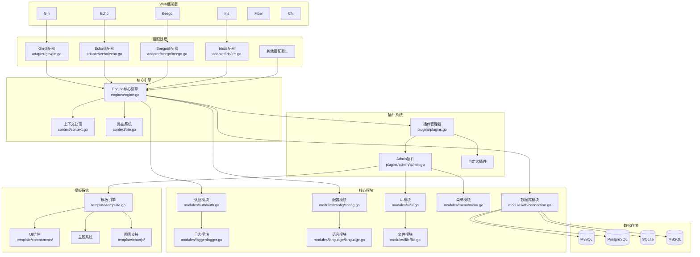
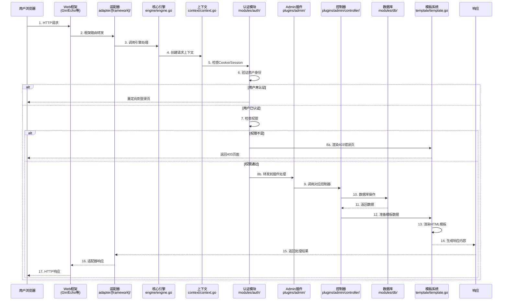
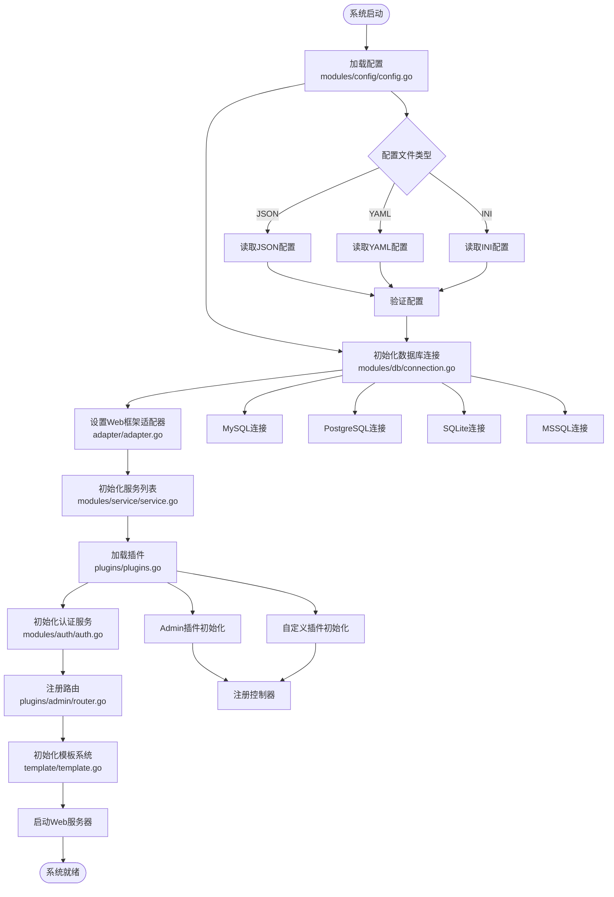
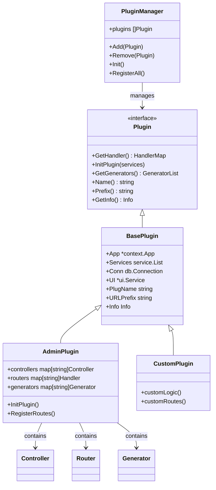
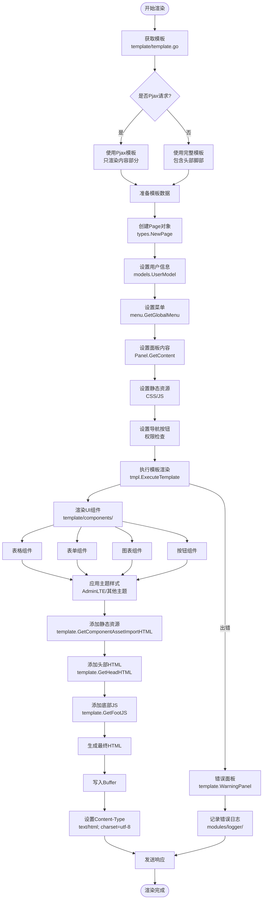

# GoAdmin系统架构与运行流程图

## 1. 系统整体架构图

## 2. 用户请求处理流程图

## 3. 系统初始化流程图

## 4. 请求到响应的详细数据流

```mermaid
graph LR
    subgraph "请求入口"
        HTTPReq[HTTP请求<br/>GET /admin/info/user]
    end
    
    subgraph "适配器处理"
        A1[路由匹配<br/>adapter/gin/gin.go]
        A2[上下文转换<br/>gin.Context → context.Context]
        A3[中间件执行<br/>认证、CORS等]
    end
    
    subgraph "认证流程"
        Auth1[获取Cookie<br/>modules/auth/session.go]
        Auth2[验证Session<br/>modules/auth/auth.go]
        Auth3[权限检查<br/>RBAC验证]
        Auth4[用户信息<br/>plugins/admin/models/]
    end
    
    subgraph "业务处理"
        B1[路由分发<br/>plugins/admin/router.go]
        B2[控制器执行<br/>plugins/admin/controller/]
        B3[数据库查询<br/>modules/db/statement.go]
        B4[数据处理<br/>业务逻辑]
    end
    
    subgraph "模板渲染"
        T1[模板选择<br/>template/template.go]
        T2[数据绑定<br/>Panel数据结构]
        T3[组件渲染<br/>template/components/]
        T4[主题应用<br/>AdminLTE等]
        T5[HTML生成<br/>最终页面]
    end
    
    subgraph "响应输出"
        R1[设置响应头<br/>Content-Type等]
        R2[写入响应体<br/>HTML内容]
        R3[发送给浏览器]
    end
    
    HTTPReq --> A1
    A1 --> A2
    A2 --> A3
    A3 --> Auth1
    Auth1 --> Auth2
    Auth2 --> Auth3
    Auth3 --> Auth4
    Auth4 --> B1
    B1 --> B2
    B2 --> B3
    B3 --> B4
    B4 --> T1
    T1 --> T2
    T2 --> T3
    T3 --> T4
    T4 --> T5
    T5 --> R1
    R1 --> R2
    R2 --> R3
```

## 5. 插件系统架构图

## 6. 模板渲染流程图

## 核心文件对应关系

| 流程步骤 | 核心文件 | 作用 |
|---------|---------|------|
| 系统启动 | `engine/engine.go` | 引擎初始化和配置加载 |
| 框架适配 | `adapter/[framework]/[framework].go` | Web框架接入 |
| 请求路由 | `context/context.go`, `context/trie.go` | 上下文和路由处理 |
| 身份认证 | `modules/auth/auth.go`, `modules/auth/middleware.go` | 用户认证和权限检查 |
| 插件处理 | `plugins/admin/admin.go`, `plugins/admin/router.go` | 业务逻辑处理 |
| 数据操作 | `modules/db/connection.go`, `modules/db/statement.go` | 数据库交互 |
| 模板渲染 | `template/template.go`, `template/components/` | UI渲染和主题应用 |
| 响应输出 | `adapter/adapter.go` | 响应格式化和输出 | 
